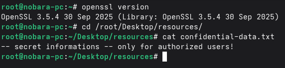
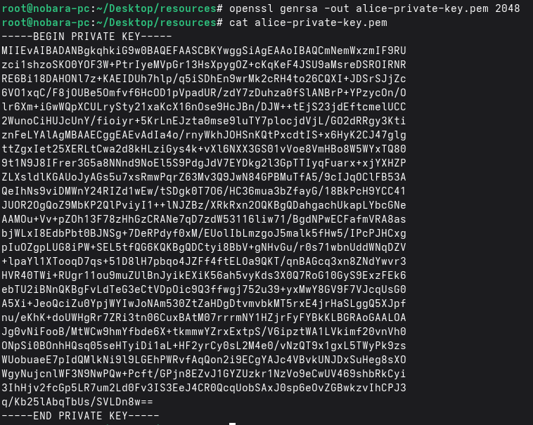
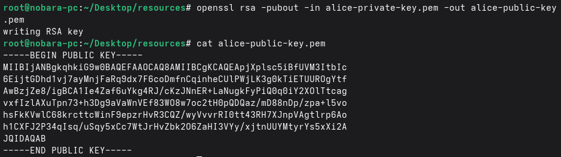
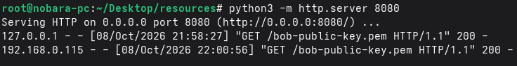
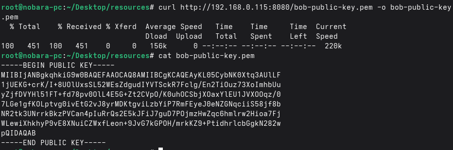
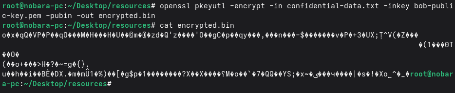
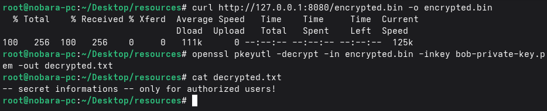

# Lab 02: Asymmetric Encryption with RSA

## Overview

In this lab, I explored **asymmetric encryption** using the **RSA algorithm** via **OpenSSL**. The goal was to understand how public and private keys work together to enable secure communication between two parties (Alice and Bob), without the need to share a secret key beforehand.

---

## Lab Environment

- **Operating System:** Linux
- **Tool:** OpenSSL
- **Machines:** Two separate Linux machines (Alice and Bob)
- **File Used:** A confidential text file

---

## Background Concepts

### What is Asymmetric Encryption?

Asymmetric encryption (also called public-key cryptography) uses a **pair of mathematically related keys**:

| Key | Purpose | Distribution |
|-----|---------|--------------|
| Public Key | Used for encryption | Shared freely |
| Private Key | Used for decryption | Kept secret by owner |

Popular algorithms include:
- **RSA** (Rivest–Shamir–Adleman)
- **DSA** (Digital Signature Algorithm)
- **ECC** (Elliptic Curve Cryptography)

### What is RSA?

RSA is one of the most widely used public-key cryptosystems. It was named after its inventors (Rivest, Shamir, and Adleman) who published it in 1977. Encryption is performed using the recipient's **public key**, and decryption is performed using the recipient's **private key**.

**Important:** RSA is not suitable for encrypting large data. In practice, it is used to transmit **shared symmetric keys**, which then handle bulk encryption.

---

## Lab Objectives

1. Generate RSA key pairs for two users (Alice and Bob).
2. Share Bob's public key with Alice.
3. Encrypt a file using Bob's public key.
4. Decrypt the file using Bob's private key.

---

## Methodology

### Step 1: Verify OpenSSL Installation

Checked that OpenSSL was installed on both machines.



### Step 2: Generate Alice's RSA Key Pair

On Alice's machine, generated a 2048-bit RSA private key:

```text
openssl genrsa -out alice-private-key.pem 2048
```



Derived the corresponding public key from the private key:

```text
openssl rsa -pubout -in alice-private-key.pem -out alice-public-key.pem
```



Step 3: Generate Bob's RSA Key Pair

On Bob's machine, repeated the same process:

```text
openssl genrsa -out bob-private-key.pem 2048
openssl rsa -pubout -in bob-private-key.pem -out bob-public-key.pem
```

Step 4: Share Bob's Public Key with Alice

To transfer Bob's public key to Alice, I started a simple HTTP server on Bob's machine:

```text
python3 -m http.server 8080
```


Then, from Alice's machine, I fetched Bob's public key:

```text
curl http://<Bob_IP>:8080/bob-public-key.pem -o bob-public-key.pem
```


Step 5: Encrypt the File Using Bob's Public Key

On Alice's machine, encrypted the confidential file using Bob's public key:

```text
openssl pkeyutl -encrypt -in confidential-data.txt -inkey bob-public-key.pem -pubin -out encrypted.bin
```


Command breakdown:

Flag Meaning
-encrypt Specifies encryption mode
-in Input file to encrypt
-inkey Key file to use
-pubin Indicates the key is a public key
-out Output encrypted file

Step 6: Share the Encrypted File with Bob

Started an HTTP server on Alice's machine to serve the encrypted file:

```text
python3 -m http.server 8080
```

Then, from Bob's machine, fetched the encrypted file:

```text
curl http://<Alice_IP>:8080/encrypted.bin -o encrypted.bin
```

Step 7: Decrypt the File Using Bob's Private Key

On Bob's machine, decrypted the file using his private key:

```text
openssl pkeyutl -decrypt -in encrypted.bin -inkey bob-private-key.pem -out decrypted.txt
```



Verified the contents matched the original file.

---

Key Observations

- Only Bob's private key could decrypt the file — Alice could not decrypt it even though she encrypted it.
- The public key can be shared openly; the private key must remain secret.
- RSA is computationally expensive and not designed for large files.
- In real-world scenarios, RSA is used to exchange a symmetric key that then encrypts bulk data.

---

Lessons Learned

- Asymmetric encryption solves the key distribution problem of symmetric encryption.
- RSA's security relies on the mathematical difficulty of factoring large prime numbers.
- A hybrid approach (RSA + AES) is used in real protocols like TLS/HTTPS.
- Key size matters — 2048-bit is the current minimum standard.

---

Tools Used

- OpenSSL
- Python 3 (http.server)
- Linux
- Terminal
