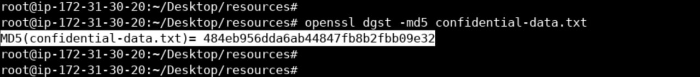
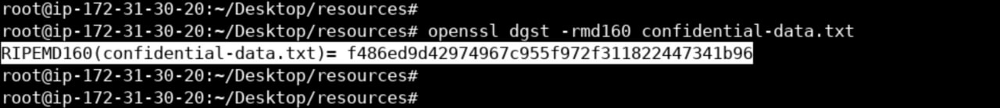
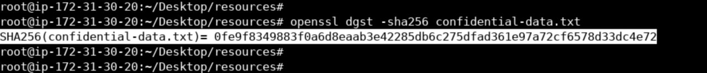
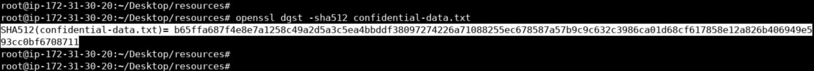
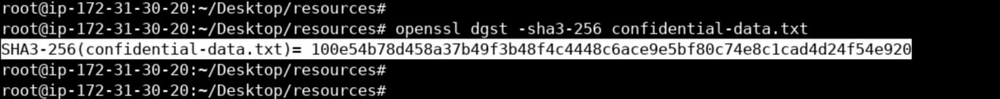
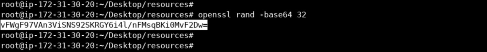
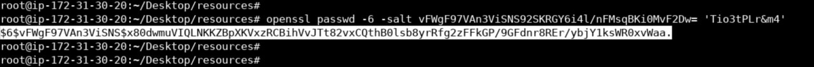

# Lab 03: Hashing Algorithms with OpenSSL

## Overview

In this lab, I explored **hashing algorithms** using **OpenSSL**. The goal was to understand how hash functions convert input data into fixed-size outputs, and how they are used for data integrity and password storage. I also practiced **salting** as a technique to strengthen password hashes.

---

## Lab Environment

- **Operating System:** Linux
- **Tool:** OpenSSL
- **File Used:** A confidential text file

---

## Background Concepts

### What is Hashing?

Hashing is the process of converting input data into a fixed-size string of characters called a **hash value**. Key properties:
- **Deterministic:** Same input always produces the same hash.
- **One-way:** Cannot reverse the hash to get the original input.
- **Avalanche effect:** Small changes in input produce drastically different hashes.

### Common Hashing Algorithms

| Algorithm | Output Size | Status |
|-----------|-------------|--------|
| MD5 | 128-bit | Broken (collision attacks) |
| RIPEMD-160 | 160-bit | Older, used in Bitcoin |
| SHA-256 | 256-bit | Widely used, secure |
| SHA-512 | 512-bit | Larger output, secure |
| SHA3-256 | 256-bit | Newest family (Keccak) |

### What is Salting?

Salting adds a random value to the input before hashing. This ensures that even identical passwords produce different hashes, protecting against:
- **Rainbow table attacks**
- **Brute-force attacks**

---

## Lab Objectives

1. Generate hashes of a file using multiple algorithms.
2. Compare hash outputs.
3. Generate a salted password hash using SHA-512.

---

## Methodology


### Step 1: Generate File Hashes

Generated hashes of the same file using different algorithms:

```text
openssl dgst -md5 confidential-data.txt
openssl dgst -rmd160 confidential-data.txt
openssl dgst -sha256 confidential-data.txt
openssl dgst -sha512 confidential-data.txt
openssl dgst -sha3-256 confidential-data.txt
```











Each command produced a different hash value of different lengths, confirming the unique properties of each algorithm.

### Step 2: Generate a Random Salt

Created a random base64-encoded salt:

```text
openssl rand -base64 32
```



### Step 3: Hash a Password with Salt

Used SHA-512-based password hashing with the generated salt:

```text
openssl passwd -6 -salt <salt_value> 'Tio3tPLr&m4'
```



Output format: $id$salt$hash

- $6$ indicates SHA-512
- The next part is the salt
- The rest is the resulting hash

---

Key Observations

- MD5 is fast but considered broken for security purposes.
- SHA-256 and SHA-512 are considered secure for most applications.
- SHA3 uses a different internal construction (Keccak sponge) and is resistant to length-extension attacks.
- Salting makes identical passwords produce different hashes, defeating precomputed attacks.
- Hash length increases with algorithm strength (e.g., SHA-512 > SHA-256 > MD5).

---

Lessons Learned

- Hashing is essential for data integrity and password storage.
- Never use MD5 or SHA-1 for security-sensitive purposes.
- Always salt password hashes before storing them.
- OpenSSL provides a simple interface for a wide range of hashing algorithms.

---

Tools Used

- OpenSSL
- Linux
- Terminal
