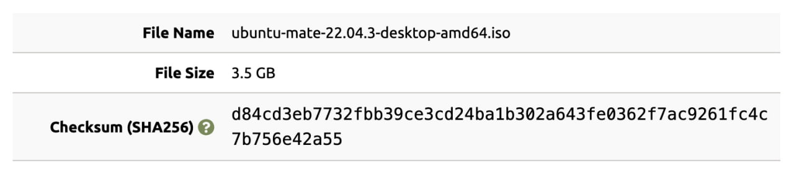
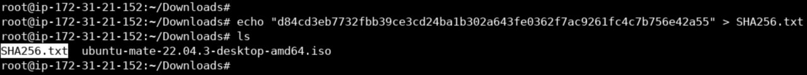
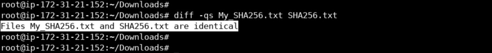
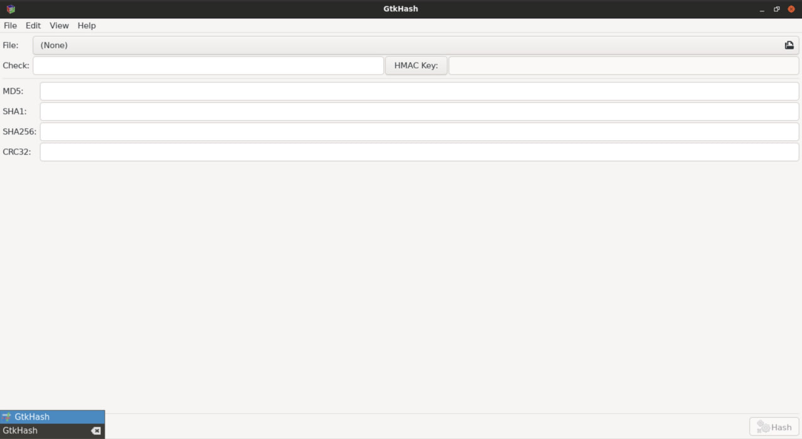
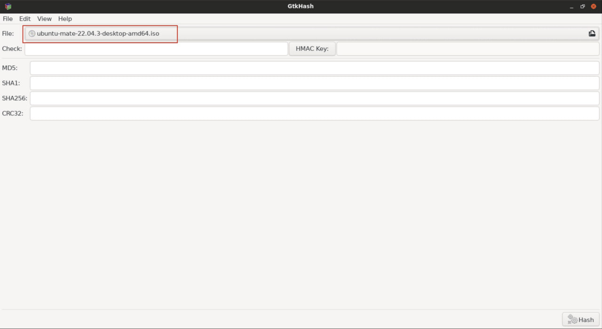
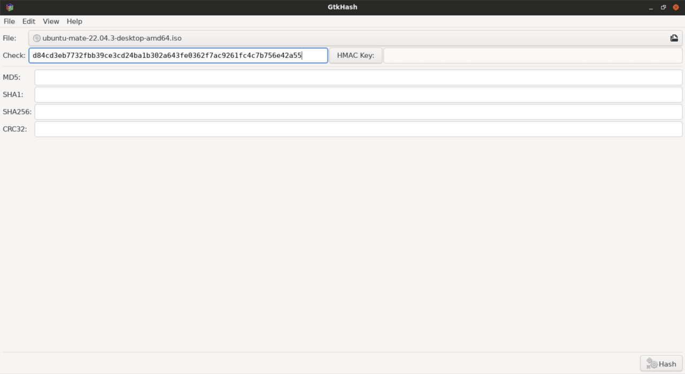
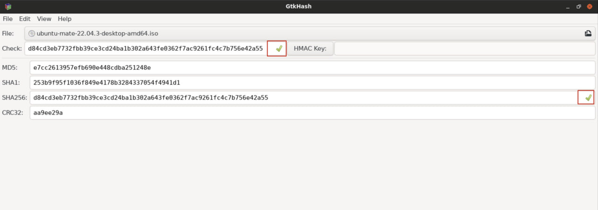

# Lab 04: Checksum Verification

## Overview

In this lab, I explored **checksum verification** as a method to confirm the **integrity** of downloaded files. The goal was to verify that a downloaded ISO file had not been corrupted or tampered with during transfer, by comparing its SHA-256 checksum against the value published by the official source.

---

## Lab Environment

- **Operating System:** Linux
- **Tools:** sha256sum, OpenSSL, GtkHash
- **File Used:** A downloaded Ubuntu MATE ISO file

---

## Background Concepts

### What is a Checksum?

A checksum is a value derived from the digital data of a file, used to verify its integrity. If even a single bit of the file changes, the checksum will change completely.

### Why Use Checksums?

- **Integrity verification:** Confirms the file was not corrupted during download.
- **Tamper detection:** Confirms the file was not modified by a third party.
- **Trust:** Many software vendors publish official checksums on their websites.

### Common Checksum Algorithms

| Algorithm | Notes |
|-----------|-------|
| MD5 | Fast but cryptographically broken |
| SHA-1 | Deprecated for security use |
| SHA-256 | Widely used, considered secure |
| SHA-512 | Larger output, more secure |

---

## Lab Objectives

1. Understand how checksums verify file integrity.
2. Compute a file's SHA-256 checksum from the command line.
3. Verify the checksum using a GUI tool.

---

## Methodology

### Step 1: Review the Published Checksum

The official SHA-256 checksum of the ISO file was published on the vendor's website. I saved it to a reference file:

```text
echo "<official_sha256_checksum>" > SHA256.txt
```




Step 2: Compute the File's Checksum (CLI)

Calculated the SHA-256 checksum of the downloaded ISO file:

```text
sha256sum ubuntu-mate-22.04.3-desktop-amd64.iso
```

Alternative: Using OpenSSL's general-purpose digest command:

```text
openssl dgst -sha256 ubuntu-mate-22.04.3-desktop-amd64.iso
```

Both commands produced the same output.

Step 3: Compare the Checksums

Saved my computed checksum to a file:

```text
echo "<computed_sha256_checksum>" > My_SHA256.txt
```

Compared both files:

```text
diff -qs My_SHA256.txt SHA256.txt
```



Command breakdown:

Flag Meaning
-q Report only when files differ
-s Report when files are the same

Result: Both files matched, confirming the ISO file was intact and unmodified.

Step 4: Verify Using GtkHash (GUI)

As an alternative method, I used GtkHash, a free desktop utility for computing checksums:

1. Loaded the ISO file into GtkHash.
2. Pasted the official SHA-256 checksum into the "Check" field.
3. Clicked Hash.









Result: Green checkmarks appeared, confirming the checksum matched.

---

Key Observations

- Both CLI and GUI methods produced the same result, confirming consistency.
- A single altered byte would have produced an entirely different hash (avalanche effect).
- Checking checksums is a simple but critical step before running downloaded files.
- SHA-256 is the current recommended standard for file integrity checks.

---

Lessons Learned

- Checksum verification protects against corrupted downloads and tampered files.
- The diff command is a lightweight way to compare checksums from two sources.
- GUI tools like GtkHash make verification accessible to non-technical users.
- Always obtain the official checksum from a trusted, HTTPS-protected source.

---

Tools Used

- sha256sum
- OpenSSL
- GtkHash
- Linux
- Terminal
