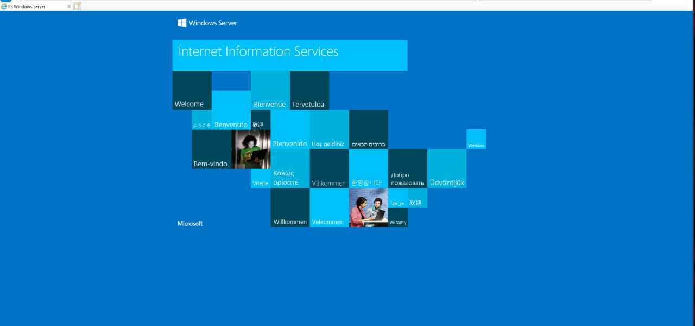
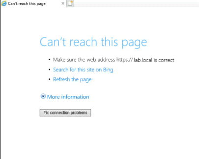
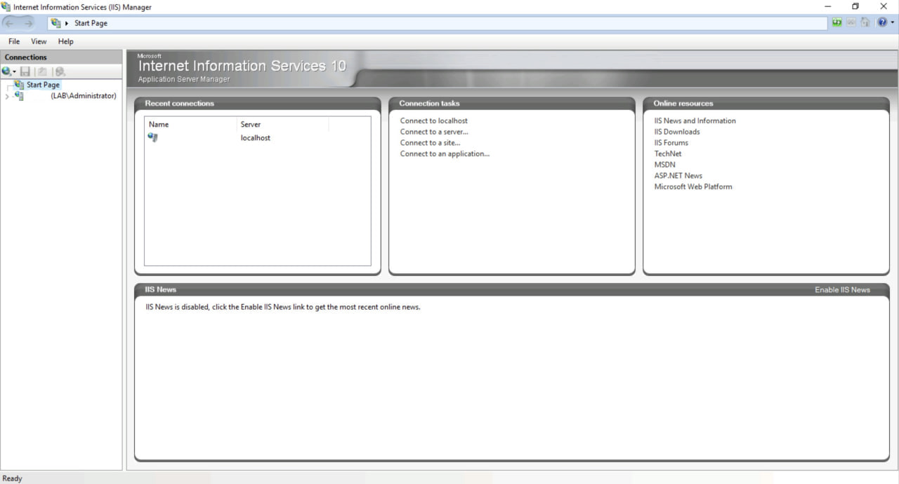
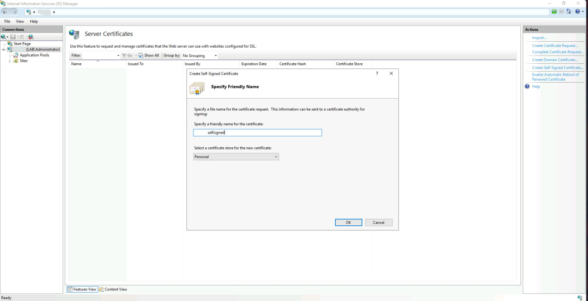
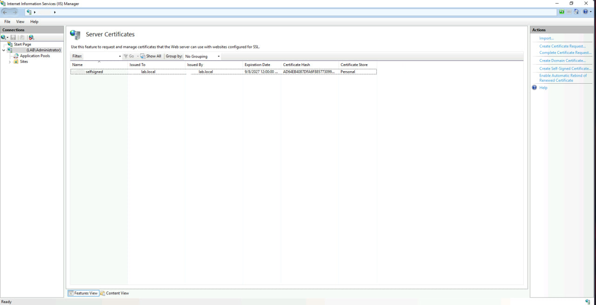
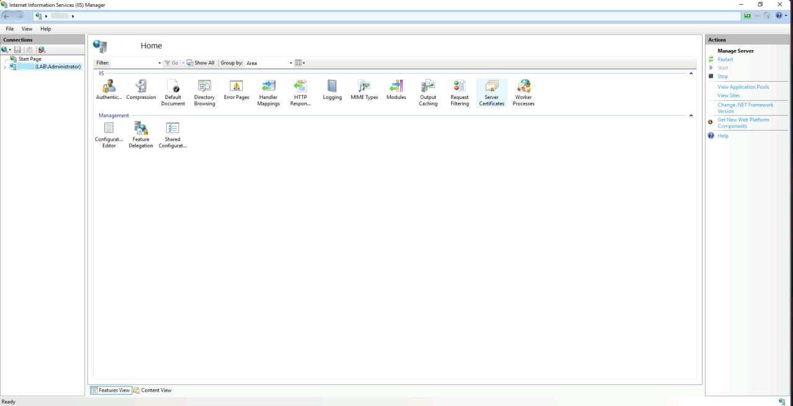
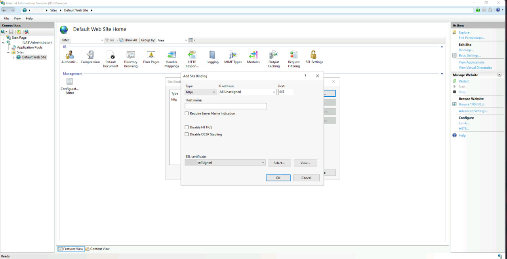
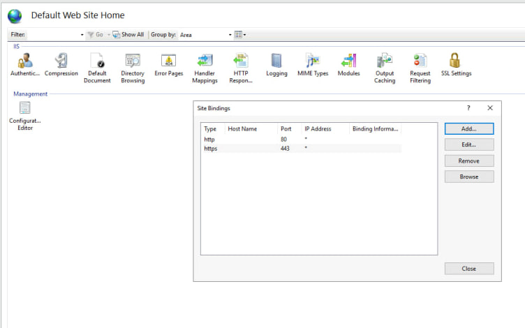
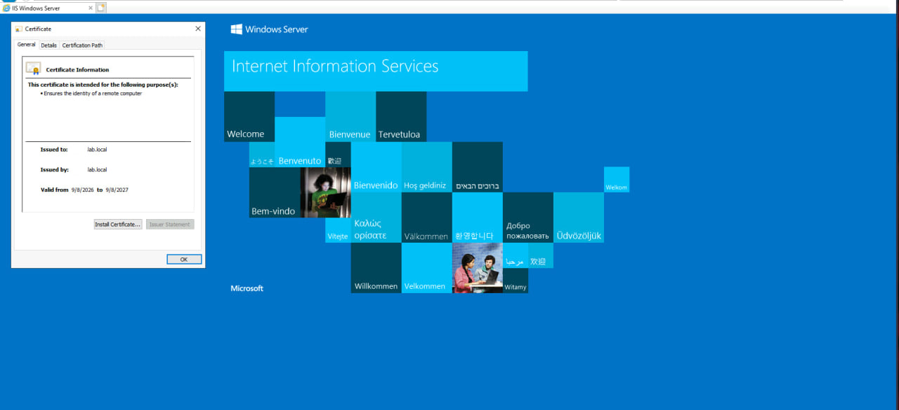
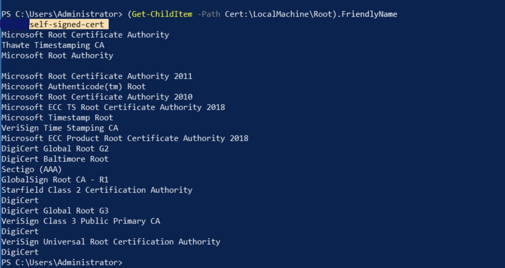

# Lab 05: Self-Signed Certificates in IIS

## Overview

In this lab, I explored **self-signed certificates** and how to use them to enable **HTTPS** on a web server. The goal was to understand the difference between certificates issued by a trusted Certificate Authority (CA) and self-signed certificates, and to configure IIS to serve content over HTTPS.

---

## Lab Environment

- **Operating System:** Windows Server 2019
- **Web Server:** Internet Information Services (IIS)
- **Tool:** IIS Manager
- **Browser:** Internet Explorer

---

## Background Concepts

### What is a Self-Signed Certificate?

A self-signed certificate is a digital certificate that is **generated and signed by the same entity** that owns it, rather than by a trusted third-party Certificate Authority (CA).

| Aspect | CA-Signed Certificate | Self-Signed Certificate |
|--------|----------------------|-------------------------|
| Trust | Trusted by browsers automatically | Requires manual trust |
| Cost | Paid | Free |
| Use Case | Production websites | Development, testing, internal use |
| Verification | Third-party verified | Self-verified only |

### Why Use HTTPS?

HTTPS encrypts communication between the client and the server using TLS. This protects:
- **Confidentiality** — data cannot be read by third parties
- **Integrity** — data cannot be modified in transit
- **Authentication** — the server's identity can be verified

### When Are Self-Signed Certificates Appropriate?

- Internal applications not exposed to the public
- Development and testing environments
- Lab and learning scenarios
- Cost-sensitive internal services

**Note:** Self-signed certificates are not suitable for public-facing production websites because browsers will show security warnings.

---

## Lab Objectives

1. Create a self-signed certificate in IIS.
2. Bind the certificate to a website.
3. Access the website securely over HTTPS.

---

## Methodology

### Step 1: Verify HTTP Access

Accessed the default IIS website over HTTP:

```text
http://lab.local
```



The site loaded successfully, confirming IIS was running.

Attempted to access the same site over HTTPS:

```text
https://lab.local
```



The site failed to load, because no certificate was bound to port 443.

Step 2: Create a Self-Signed Certificate

1. Opened IIS Manager.
2. Selected the server name in the left panel.
3. Clicked Server Certificates.
4. Clicked Create Self-Signed Certificate in the Actions panel.
5. Provided a friendly name for the certificate.
6. Confirmed creation — the certificate was valid for one year.







Step 3: Bind the Certificate to the Website

1. Expanded Sites and selected Default Web Site.
2. Clicked Bindings in the Actions panel.
3. Clicked Add.
4. Selected https as the type.
5. Chose the newly created self-signed certificate from the SSL certificate dropdown.
6. Clicked OK.







A new binding on port 443 was created.

Step 4: Test HTTPS Access

Accessed the site again:

```text
https://lab.local
```



The site loaded successfully over HTTPS. I clicked the padlock icon in the browser to view the certificate details.

Note: A warning appeared indicating the certificate was not issued by a trusted CA. This is expected for self-signed certificates. On Windows Server 2019, the certificate is also added to the local Trusted Root Certification Authorities store, so the local machine trusts it.

To verify this, I ran the following PowerShell command:

```powershell
(Get-ChildItem -Path Cert:\LocalMachine\Root).FriendlyName
```



The self-signed certificate appeared in the list.

---

Key Observations

- Self-signed certificates provide encryption but not third-party trust.
- Browsers will show warnings for untrusted certificates unless manually added to the trust store.
- Binding a certificate to a website is a simple process in IIS.
- HTTPS protects data in transit, which is essential even for internal sites.

---

Lessons Learned

- Certificates are essential for secure web communication.
- Self-signed certificates are useful for internal and testing environments.
- In production, certificates should always be obtained from a trusted CA.
- Understanding the trust model behind PKI is crucial for anyone in cybersecurity.

---

Tools Used

- IIS Manager
- Windows Server 2019
- Internet Explorer
- PowerShell
